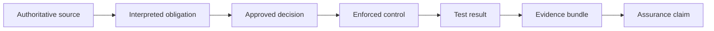

# Assurance Evidence

An assurance claim should be accepted only when the evidence chain connects authority to enforcement.

{: .evidence }
> Preserve source version, decision owner, control version, test procedure, result, and evidence retention period together.


