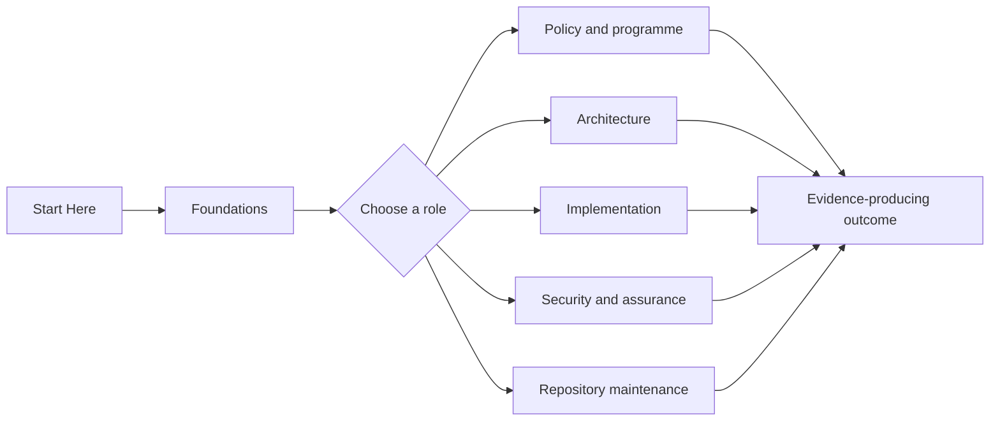

# ARF On-Ramp Pack

Use this documentation to move from authoritative ARF and legal material to bounded implementation, governance, testing, and assurance decisions.

{: .authority }
> This repository is companion guidance. Law, adopted implementing acts, and canonical upstream repositories remain authoritative within their respective scopes.

## Choose an outcome

| Need | Start here | Evidence produced |
|---|---|---|
| Establish authority and program scope | [Start Here](./start-here/) | authority inventory and decision ownership |
| Understand the system structure | [Foundations](./foundations/) | shared terminology and authority model |
| Translate obligations into architecture | [Architecture](./architecture/) | context, boundary, and decision artifacts |
| Plan delivery and conformance | [Implementation](./implementation/) | backlog, traceability, and test plan |
| Establish controls and evidence | [Governance and Assurance](./governance-assurance/) | control mapping and evidence catalog |
| Follow a role-specific journey | [Guided Learning](./learning/) | role-specific completion artifact |
| Operate upstream synchronization | [Operations](./operations/) | drift report and impact assessment |
| Look up an answer quickly | [Reference](./reference/) | source and terminology lookup |

## How the guided experience works

1. Start with the common authority and scope material.
2. Select a role-specific journey.
3. complete the decision checkpoints.
4. produce the named implementation or assurance artifact.
5. use the Previous and Next controls at the end of every sequenced page.


