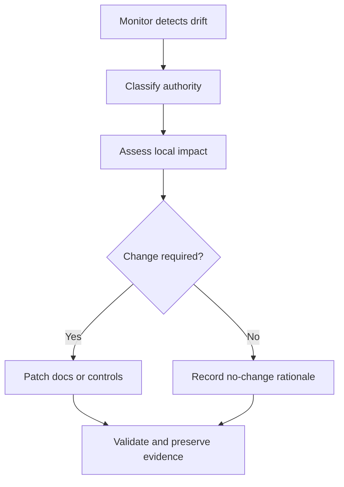

# Drift Assessment

Use this procedure after the monitor reports a change.

| Step | Question | Evidence |
|---|---|---|
| classify | What source changed and what authority does it carry? | monitor report and source snapshot |
| scope | Which local interpretations or links depend on it? | impact list |
| decide | Is a content, control, or test update required? | approved assessment |
| implement | What files and artifacts change? | patch and test results |
| close | What proves alignment has been restored? | commit, report, and issue closure |


