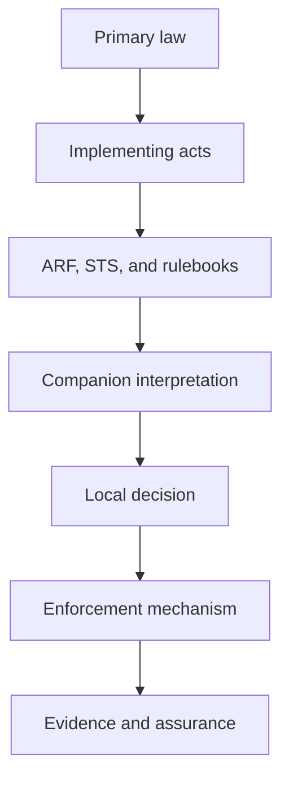

# Authority and Scope

## Authority order

1. applicable primary law;
2. adopted implementing acts;
3. canonical ARF, STS, and attestation rulebook sources within their respective scopes;
4. this companion pack; and
5. documented local implementation decisions.

{: .decision }
> For every material requirement, record the source, decision authority, enforcement point, evidence artifact, and revocation or supersession trigger.


